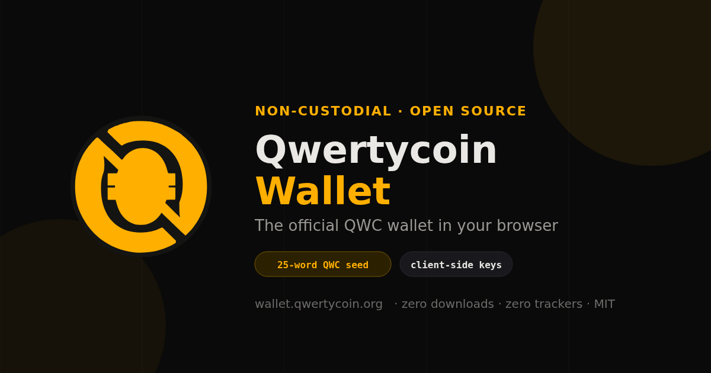

# Qwertycoin Web Wallet



The official open-source, non-custodial Qwertycoin web wallet. Private keys are derived and used inside the browser.

Live at [wallet.qwertycoin.org](https://wallet.qwertycoin.org/).

## Supported wallet access

- **Restore from seed:** exactly 25 Qwertycoin words (24 data words plus checksum)
- **Create new wallet:** a fresh 25-word QWC seed from the browser CSPRNG
- **Private spend key:** 64-character hexadecimal import
- **Watch-only:** QWC address plus private view key

Legacy 12-, 13- and 16-word seed formats from other projects are not exposed or accepted by the Qwertycoin wallet UI.

## Architecture

```text
Browser
├── Qwertycoin key derivation and address generation
├── qwertycoin-ts WebAssembly scanner
├── local transaction construction and signing
├── encrypted in-tab WalletVault session
└── local QR generation and scanning

Cloudflare Pages
├── immutable static wallet assets
├── restricted same-origin QWC RPC gateway
├── binary scanner endpoint
└── abuse controls for transaction submission

Qwertycoin infrastructure
└── qwertycoind restricted RPC (ports 8198/8199)
```

The seed, private spend key and private view key remain in the browser. The RPC gateway receives restricted blockchain queries and, when the user sends QWC, the completed signed transaction.

## Self-hosting

The maintained guide is available at [wallet.qwertycoin.org/self-host](https://wallet.qwertycoin.org/self-host) and in [`self-host.html`](self-host.html).

```bash
git clone https://github.com/qwertycoin-org/wallet.qwertycoin.org.git
cd wallet.qwertycoin.org
python3 -m http.server 8000
```

For full wallet operation, configure the Pages functions or an equivalent same-origin gateway against a restricted `qwertycoind` RPC endpoint. Do not expose unrestricted administrative RPC publicly.

## Verification

```bash
npm test
./tools/build-manifest.sh
sha256sum -c MANIFEST.sha256
```

The manifest covers every shipped HTML, JavaScript, CSS, font, image, WebAssembly and serverless-function asset.

## Security model

The wallet protects the seed and private keys from the hosting and RPC infrastructure by keeping derivation and signing in the browser. It does not protect against a compromised browser extension, operating system, fake domain, hostile code served from the canonical origin, or a user exposing their seed.

For substantial funds, use a dedicated wallet environment and independently verify the application source and domain. Report security issues through [GitHub private vulnerability reporting](https://github.com/qwertycoin-org/wallet.qwertycoin.org/security/advisories/new).

## Third-party provenance and copyright

Qwertycoin inherits CryptoNote-compatible algorithms and includes compatibility modules whose historical filenames or public JavaScript symbols contain `monero` or `mymonero`. Those technical names are intentionally retained where renaming could break interoperability or obscure provenance.

Upstream copyright, license texts and notices are preserved in:

- [`LICENSE`](LICENSE)
- [`fonts/LICENSES.md`](fonts/LICENSES.md)
- [`js/mymonero-core/LICENSE.txt`](js/mymonero-core/LICENSE.txt)
- [`vendor/qwertycoin-ts/monero.worker.js.LICENSE.txt`](vendor/qwertycoin-ts/monero.worker.js.LICENSE.txt)
- SPDX headers in source files

Do not remove or rewrite third-party attribution when modifying the wallet.

## Contributing

Pull requests should preserve funds safety, QWC v2 genesis binding, restricted-RPC policy, local key handling, deterministic manifests and responsive accessibility.

## License

The project-authored code is MIT licensed. Bundled third-party components remain under their respective licenses and copyright notices.
