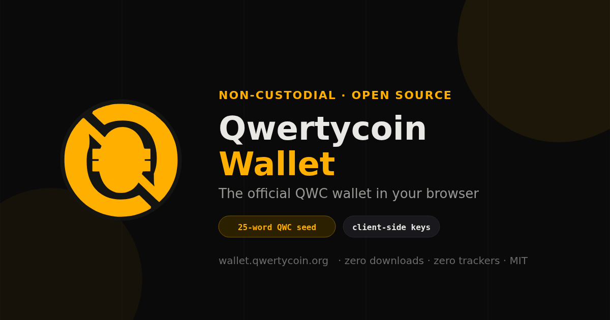

# Qwertycoin Web Wallet



The official open-source, non-custodial Qwertycoin web wallet. Private keys are derived and used inside the browser.

Live at [wallet.qwertycoin.org](https://wallet.qwertycoin.org/).

## Supported wallet access

- **Restore from seed:** exactly 25 Qwertycoin words (24 data words plus checksum), auto-detected across the 12 Core/CLI/GUI mnemonic languages
- **Create new wallet:** a fresh 25-word QWC seed from the browser CSPRNG
- **Private spend key:** 64-character hexadecimal import
- **Watch-only:** QWC address plus private view key

Legacy 12-, 13- and 16-word seed formats from other projects are not exposed or accepted by the Qwertycoin wallet UI.

The 12 supported languages are English, Spanish, French, German,
Italian, Portuguese, Russian, Japanese, Chinese (simplified), Dutch, Esperanto
and Lojban. Their checksum calculation is byte-compatible with Qwertycoin
Core, the CLI wallet and the desktop GUI. The historical `EnglishOld` list is
not a current 25-word output format and is rejected instead of generating a
Core-incompatible phrase.

Phrases generated by older Web Wallet releases with the browser-only checksum
are recognized as a dedicated compatibility case. The wallet derives the same
keys, displays the corrected Core-compatible phrase, and requires the user to
update the backup after verifying the address.

## Architecture

```text
Browser
├── Qwertycoin key derivation and address generation
├── qwertycoin-ts WebAssembly scanner
├── local spend-key message signing and signature verification
├── QMS1 encrypted Messenger compatible with the desktop wallet
├── local transaction construction and signing
├── encrypted in-tab WalletVault session
└── local QR generation and scanning

Cloudflare Pages
├── immutable static wallet assets
├── restricted same-origin QWC RPC gateway
├── binary scanner endpoint
└── abuse controls for transaction submission

Qwertycoin infrastructure
└── Dedicated wallet-rpc.qwertycoin.org restricted RPC gateway
```

The seed, private spend key and private view key remain in the browser. The RPC
gateway receives restricted blockchain queries and, when the user sends QWC,
the completed signed transaction. Message signing and verification do not use
the gateway. The dedicated pool-challenge view validates the exact address,
threshold, nonce, expiration and domain locally before creating a spend-key
signature.

Wallet access is intentionally tab-scoped: derived keys are stored in
`sessionStorage`, survive reloads in the same tab, and are removed when that
browser session is closed. The optional session password encrypts this in-tab
vault; it does not make the wallet persist across browser restarts.

## Message signing

Open **Sign / Verify** in a loaded wallet to create or verify a Qwertycoin
message signature. Messages are signed as their exact UTF-8 bytes: whitespace,
line endings and Unicode normalization are not changed. Watch-only wallets can
verify signatures but cannot create them.

Pool operators integrating payout-threshold authorization must use the strict
challenge format and server-side replay controls described in
[`docs/message-signing.md`](docs/message-signing.md).

## Messenger

The **Messenger** tab implements the QMS1/Fast Profile shared with the desktop
GUI wallet. The tab is not exposed unless the wallet was opened with a
non-empty Session password. Contacts exchange their complete 428-character personal
invitation confidentially, verify the shorter fingerprint separately, then use
**Encrypt & review** before explicitly broadcasting the carrier transactions.
Once every carrier is visible in the mempool and the sender authentication is
valid, the matching chat shows only an ephemeral **awaiting confirmation**
placeholder. The message text appears only after every carrier is confirmed and
scanned from a block.

Messages are end-to-end encrypted, authenticated and stored locally in
password-wrapped XChaCha20-Poly1305 IndexedDB records. A short message normally
fits one carrier transaction. Blockchain timing, transaction hashes,
fees and carrier activity remain public metadata. QMS1 has no forward secrecy,
ratchet recovery or post-quantum protection. See
[`docs/qms-messenger.md`](docs/qms-messenger.md) before testing it with funds.

## Self-hosting

The maintained guide is available at [wallet.qwertycoin.org/self-host](https://wallet.qwertycoin.org/self-host) and in [`self-host.html`](self-host.html).

```bash
git clone https://github.com/qwertycoin-org/wallet.qwertycoin.org.git
cd wallet.qwertycoin.org
python3 -m http.server 8000
```

For full wallet operation, configure the Pages functions or an equivalent same-origin gateway against a restricted `qwertycoind` RPC endpoint. Do not expose unrestricted administrative RPC publicly.

The QMS feature preview uses the dedicated restricted gateway at
`wallet-rpc.qwertycoin.org`; the Explorer is not in the wallet's critical path.
Only wallet-required RPC paths and methods are forwarded through the
same-origin Pages proxy.

## Verification

```bash
npm test
./tools/build-manifest.sh
sha256sum -c MANIFEST.sha256
```

The manifest covers every shipped HTML, JavaScript, CSS, font, image, WebAssembly and serverless-function asset.

## Security model

The wallet protects the seed and private keys from the hosting and RPC infrastructure by keeping derivation and signing in the browser. It does not protect against a compromised browser extension, operating system, fake domain, hostile code served from the canonical origin, or a user exposing their seed.

For substantial funds, use a dedicated wallet environment and independently verify the application source and domain. Report security issues through [GitHub private vulnerability reporting](https://github.com/qwertycoin-org/wallet.qwertycoin.org/security/advisories/new).

## Third-party provenance and copyright

All project-owned runtime files and public JavaScript symbols use Qwertycoin names. Inherited upstream names remain only inside pinned third-party implementations, licenses and provenance documentation where rewriting them would obscure origin or break compatibility.

Upstream copyright, license texts and notices are preserved in:

- [`LICENSE`](LICENSE)
- [`fonts/LICENSES.md`](fonts/LICENSES.md)
- [`vendor/qwertycoin-core-wasm/LICENSE.txt`](vendor/qwertycoin-core-wasm/LICENSE.txt)
- [`vendor/qwertycoin-ts/qwertycoin.worker.js.LICENSE.txt`](vendor/qwertycoin-ts/qwertycoin.worker.js.LICENSE.txt)
- [`vendor/libsodium/LICENSE.libsodium-wrappers-sumo`](vendor/libsodium/LICENSE.libsodium-wrappers-sumo)
- [`vendor/libsodium/BUILDINFO.txt`](vendor/libsodium/BUILDINFO.txt)
- SPDX headers in source files

Do not remove or rewrite third-party attribution when modifying the wallet.

## Contributing

Pull requests should preserve funds safety, QWC v2 genesis binding, restricted-RPC policy, local key handling, deterministic manifests and responsive accessibility.

## License

The project-authored code is MIT licensed. Bundled third-party components remain under their respective licenses and copyright notices.
