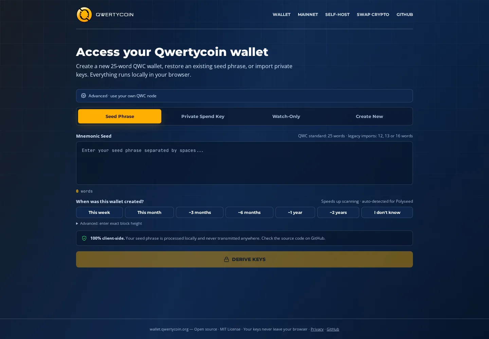
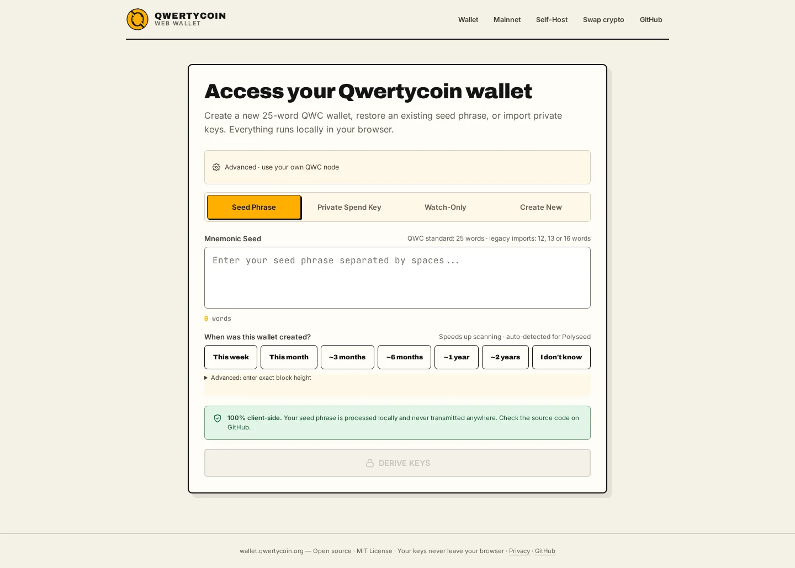
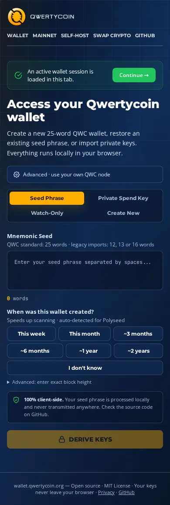
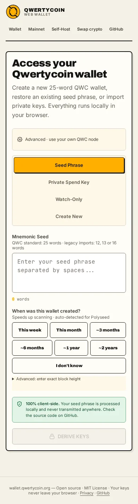
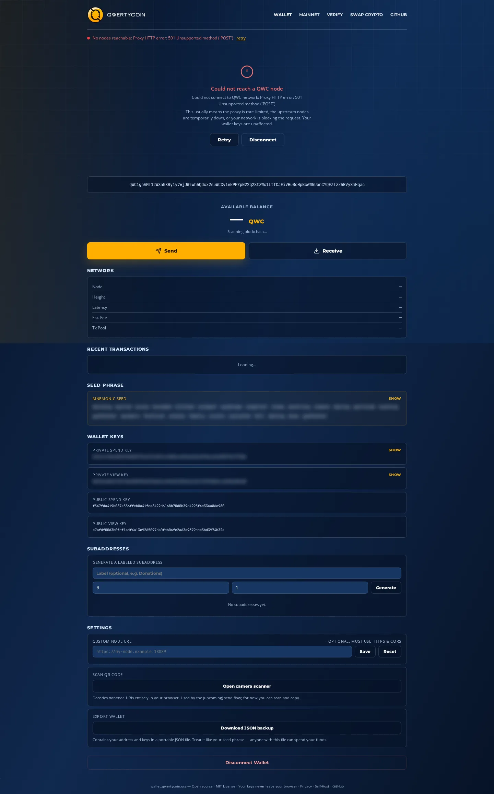
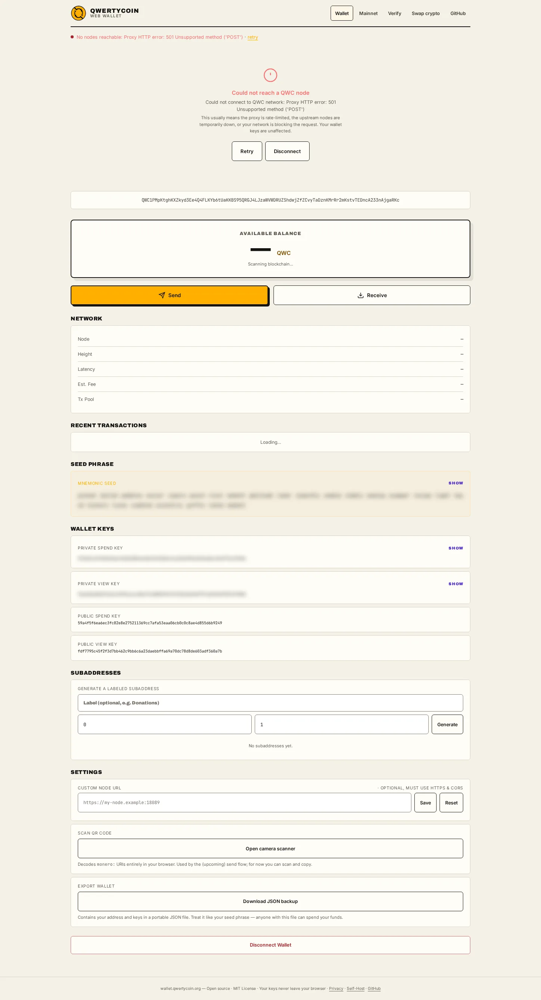
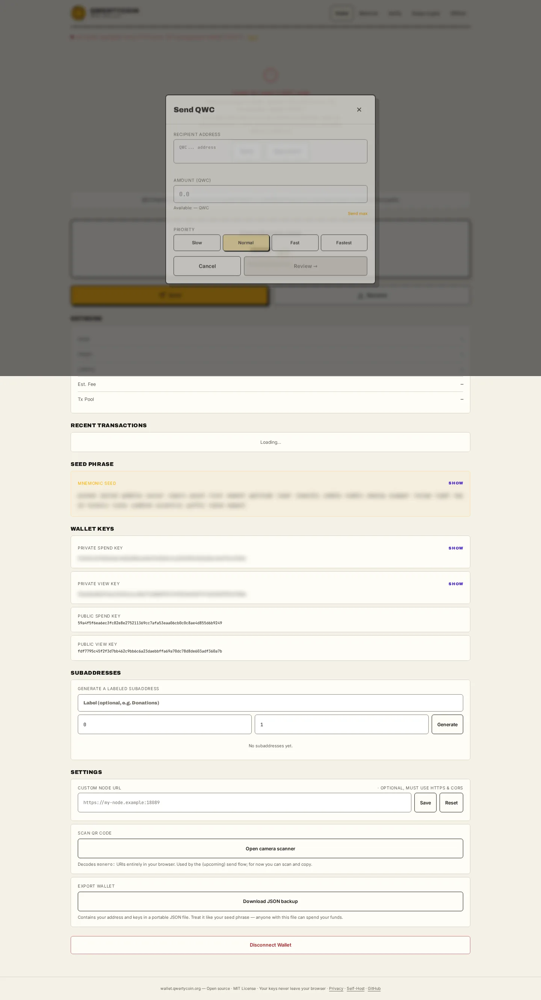
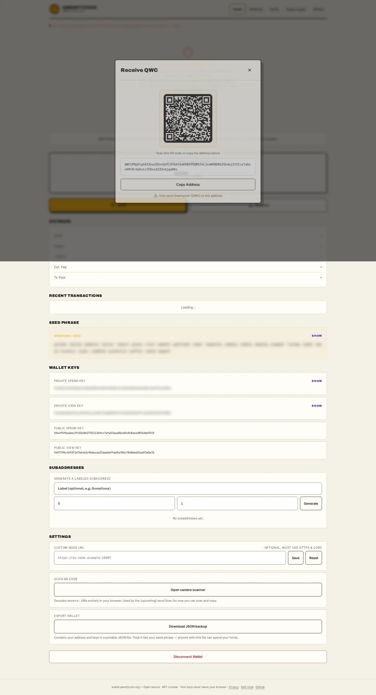
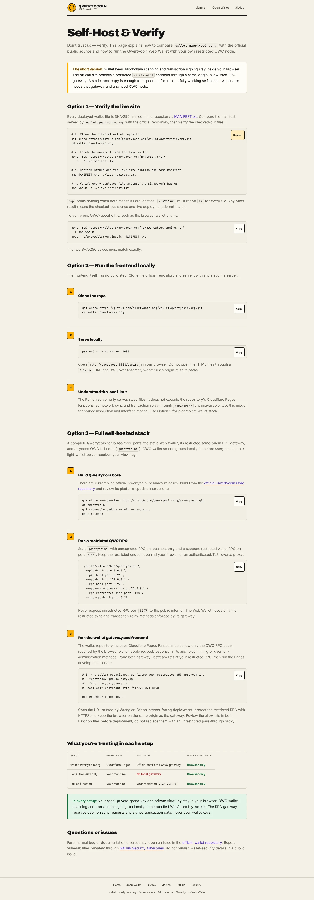
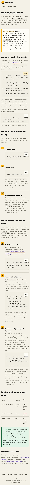

# Qwertycoin Web Wallet visual-alignment evidence

Date: 2026-09-12

Wallet baseline: `69eb5e13d36b51bcd0e5ef69a88ce15becd023e0`

Design reference: `qwertycoin-org/qwertycoin-org.github.io@cad291f45602e44c94f756c5592167771dee7681`

## Scope and invariants

This change aligns presentation and self-hosting guidance. It adds the approved Qwertycoin mark, local
Archivo/Inter fonts, the cream/black/gold/violet visual system, responsive
layout rules, a complete favicon matrix, and QWC-specific verification and
self-hosting instructions. It also removes the unsupported third-party swap
navigation, widget, provider permission, and roadmap entry. A follow-up makes
the public wallet surface Qwertycoin-native: restore accepts exactly the
25-word QWC seed format, payment URIs use `qwertycoin:`, and explorer links use
the official Qwertycoin explorer. Session storage, encryption, scanning,
amounts, fees, transaction construction/signing/relay, and cryptographic
primitives are unchanged.

Of the 43 retained JavaScript/Worker/server files listed in
[`protected-logic.sha256`](protected-logic.sha256), 38 remain byte-identical to
the original redesign baseline. Five have narrow reviewed QWC-facing changes:
`js/verify-page.js` enforces the 25-word format and estimates an optional restore
height from the live QWC tip, `js/qr-scanner.js` accepts the Qwertycoin URI
scheme, `js/dashboard-page.js` emits Qwertycoin URIs and explorer links while
failing legacy foreign-chain restore metadata back to genesis, and
`js/index-page.js` plus `functions/_middleware.js` have comment-only terminology
updates. The hash file records the new reviewed state. The unsupported
presentation-only `js/swap-popup.js` remains removed.

The redesign intentionally preserves functional IDs/classes and inline
`display`/`hidden` state ownership. The shared stylesheet is loaded after the
legacy page styles and overrides presentation only.

## Visual coverage

The browser matrix exercised:

- seed, private-spend-key, watch-only, and create tabs;
- newly generated throwaway wallet and dashboard;
- balance/loading/network/error states;
- send form, receive QR, unlock, rate-limit, and QR-scanner dialogs;
- keys (still blurred), mnemonic, subaddresses, custom node, export, and disconnect;
- privacy and self-host documents;
- 360, 390, 768, 1024, and 1440 px widths plus a 1440 px viewport at 200% zoom equivalence.

No real seed, private wallet data, or Mainnet transfer was used. Screenshots
contain only an isolated generated throwaway wallet; private values remain
visually obscured.

## Before / after

### Wallet access — desktop

| Before | After |
| --- | --- |
|  |  |

### Wallet access — 390 px

| Before | After |
| --- | --- |
|  |  |

### Dashboard — desktop

| Before | After |
| --- | --- |
|  |  |

### Send and receive

| Send | Receive |
| --- | --- |
|  |  |

Additional evidence is in [`screenshots/after`](screenshots/after), including
mobile dialogs, create/watch-only states, unlock, rate-limit, QR scanner,
privacy, and self-host pages.

### Qwertycoin self-host guide

| Desktop | 390 px |
| --- | --- |
|  |  |

## Verification

| Check | Result |
| --- | --- |
| Existing wallet tests | 44/44 PASS |
| Presentation-contract tests | 12/12 PASS |
| Manifest build and `--check` | 64/64 files PASS |
| Protected logic review | 38/43 byte-identical; 5 narrow QWC-facing diffs reviewed |
| Legal/copyright file hashes | 4/4 unchanged PASS |
| Generated 25-word wallet restore | PASS |
| Visible legacy-brand scan | 0 occurrences across 5 public pages |
| Responsive overflow matrix | 24/24 page/viewport combinations PASS |
| Browser interaction/state checks | PASS |
| Unexpected failed asset requests | 0 |
| HTML structural validation | no structural errors |

The Python static preview cannot execute Cloudflare Functions, so its controlled
dashboard run intentionally receives HTTP 501 for `/api/proxy` and exercises
the existing node-error state. The deployed PR preview is checked separately
against the real same-origin proxy before approval.

## Lighthouse (local, commit under review)

Chrome headless, Lighthouse defaults for mobile and `--preset=desktop` for
desktop, served from the local static preview. Scores are
Performance / Accessibility / Best Practices / SEO.

| Page/profile | Scores | LCP | CLS | TBT |
| --- | --- | ---: | ---: | ---: |
| Verify / mobile | 88 / 100 / 100 / 100 | 3,835 ms | 0.0023 | 0 ms |
| Verify / desktop | 100 / 100 / 100 / 100 | 777 ms | 0.0023 | 0 ms |
| Privacy / mobile | 100 / 100 / 100 / 100 | 1,656 ms | 0.0146 | 0 ms |
| Privacy / desktop | 100 / 100 / 100 / 100 | 363 ms | 0.0107 | 0 ms |
| Self-host / mobile | 99 / 100 / 100 / 100 | 1,808 ms | 0.0268 | 0 ms |
| Self-host / desktop | 100 / 100 / 100 / 100 | 409 ms | 0.0066 | 0 ms |

The local mobile Verify result is dominated by the existing synchronous wallet
and wordlist payload on Lighthouse's throttled profile, served without edge
compression. Script order and wallet loading semantics were intentionally not
changed in a presentation-only PR. The compressed deployment preview is the
release-facing measurement.

## Asset delivery

- Original Q mark is copied byte-for-byte from the approved website source.
- Archivo 900 and Inter 400/600 are local, content-addressed WOFF2 files.
- Font licensing is shipped in `fonts/LICENSES.md`.
- SVG, 16 px PNG, 32 px PNG, multi-size ICO, 180 px Apple touch, and 192 px
  icons all use the approved Q mark.
- New CSS, icons, fonts, and license data are included in `MANIFEST.txt`.
- Presentation assets remain same-origin; no font CDN, analytics, or new
  runtime dependency is introduced.

## Compatibility and provenance

Internal dependency filenames, legacy storage keys, and third-party license
notices retain upstream names where changing them would break compatibility or
erase attribution. They are not shown as supported wallet formats or public
Qwertycoin branding. Copyright and license texts remain byte-identical.
